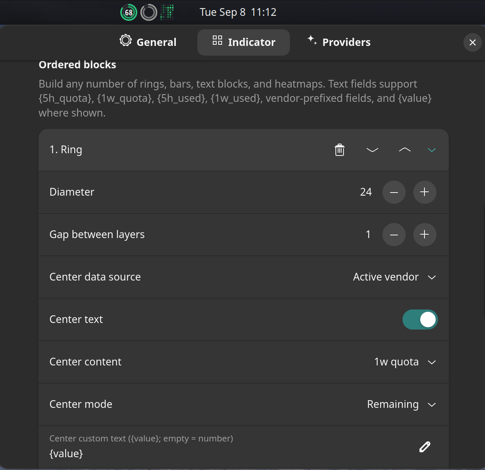

# AI Usage Bar Graph

A compact and highly configurable GNOME Shell panel extension for monitoring AI quota usage, reset times, and recent activity.

Repository: [`WilliamMarci/ai-usagebar-graph`](https://github.com/WilliamMarci/ai-usagebar-graph)



## About this fork

This project is forked from [`akitaonrails/ai-usagebar`](https://github.com/akitaonrails/ai-usagebar). It keeps the original extension's lightweight quota-monitoring purpose while expanding the panel indicator, provider support, and preferences substantially.

The main changes in this fork are:

- A composable graphical indicator made from any number of rings, rounded bars, text blocks, countdowns, and GitHub-style heatmaps
- Ordered multi-layer rings and bars with independent providers, quota sources, used/remaining modes, thickness, spacing, labels, colors, severity tiers, and optional position dots
- Compact single- and double-line text with quota placeholders and provider-prefixed fields
- Low-overhead, width-responsive heatmaps with Monday/Sunday alignment and usage intensity shades
- Placement in GNOME Shell's left, center, or right panel box, including Dash to Panel layouts
- Anthropic, OpenAI/Codex, Z.AI, OpenRouter, DeepSeek, Kimi, and distinct OpenCode Go/Zen configuration
- OpenCode quota discovery inspired by [TokScale](https://github.com/junhoyeo/tokscale), plus an optional OpenCode aggregate source for DeepSeek
- Provider connection diagnostics, unsupported-source warnings, configurable reset countdowns, and settings import/export

## Requirements

- GNOME Shell 50
- The credentials or API keys required by the providers you enable
- A refresh interval of at least five minutes; the extension enforces this minimum to respect upstream rate limits

## Development installation

Clone the repository into the extension's UUID directory:

```sh
git clone https://github.com/WilliamMarci/ai-usagebar-graph.git \
  ~/.local/share/gnome-shell/extensions/ai-usagebar@wilfison
cd ~/.local/share/gnome-shell/extensions/ai-usagebar@wilfison
glib-compile-schemas schemas
```

Log out and back in, then enable **AI Usage Bar Graph**. On Wayland, GNOME Shell does not reliably reload extension JavaScript or schemas in place.

## Configuration

Open the extension preferences and use:

- **General** for refresh cadence, popup behavior, notifications, global severity colors, and settings import/export
- **Indicator** to arrange blocks and layers, choose panel placement, and configure graphical appearance
- **Providers** to configure and test each data source

Text fields support placeholders such as `{5h_quota}`, `{1w_quota}`, `{5h_used}`, `{1w_used}`, `{session_remaining}`, and provider-prefixed forms such as `{openai_weekly_remaining}`. The misspelled aliases `{5h_quote}` and `{1w_quote}` are also accepted for compatibility.

Settings exports are plain JSON and may contain inline API keys. Treat exported files as secrets.

OpenCode Go quota is queried directly from the official authenticated `GET /zen/go/v1/usage` JSON endpoint. OpenCode Zen is a separate pay-as-you-go product; OpenCode currently provides no API-key endpoint for its credit balance, so the extension reports that limitation instead of showing Go quota data under the Zen name.

## Privacy and network behavior

Credentials stay in GNOME settings or in their configured files/environment variables. The extension sends credentials only to the endpoint of the provider being queried. Refreshes are intentionally infrequent to minimize panel overhead and network traffic.

## Development checks

```sh
node --check extension.js
node --check prefs.js
node --check ui/panelVisual.js
node --check lib/indicator-layout.js
glib-compile-schemas --strict schemas
git diff --check
```

## Contributing

Issues and pull requests are welcome. Keep changes focused, preserve the compact panel layout, and run the checks above before submitting.

## Acknowledgements

- [`akitaonrails/ai-usagebar`](https://github.com/akitaonrails/ai-usagebar) — original project and foundation
- [`junhoyeo/tokscale`](https://github.com/junhoyeo/tokscale) — reference for OpenCode usage discovery
